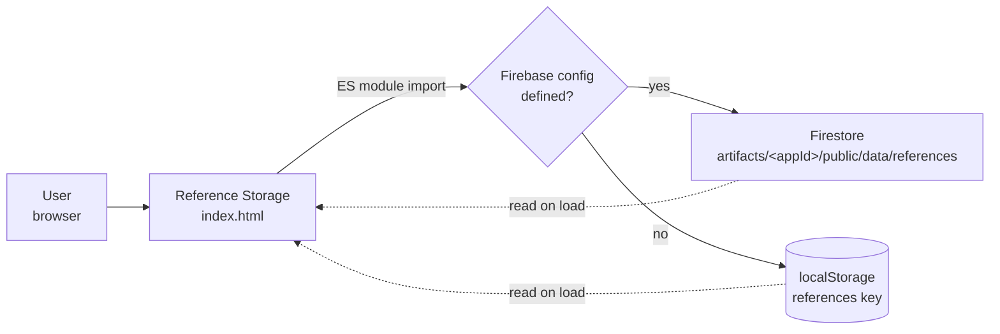

<div align="center">

# Reference Storage

**A minimalist reference manager built for the M7 Human Resources Management & Leadership course at HTW Berlin — backing the presentation *"Leading Minds, Not Just Tasks."***

[](https://hr-leadership-course.vercel.app/)
[](LICENSE)
[](#academic-context)
[](#project-status)
[](https://tailwindcss.com/)
[](https://firebase.google.com/)
[](https://developer.mozilla.org/en-US/docs/Web/JavaScript/Guide/Modules)

[Live demo](https://hr-leadership-course.vercel.app/) · [Features](#features) · [Architecture](#architecture) · [Run locally](#getting-started) · [Firebase setup](#optional-firebase-setup) · [Roadmap](#roadmap)


</div>

---

## Overview

**Reference Storage** is a single-page web app for curating the bibliography behind a course presentation. It was built to accompany:

> **"Leading Minds, Not Just Tasks: Transformational Leadership and Effective Communication in Life Sciences"**
> *— with reflections from BioNTech's COVID-19 mRNA vaccine case study*

The app provides a clean, distraction-free interface for adding, sorting, and managing academic sources. References are persisted to **Firebase Firestore** when configured, with a transparent **`localStorage` fallback** so the app remains fully functional offline and on cold clones.

## Project status

| | |
|---|---|
| **Phase** | Concept / academic deliverable |
| **Course module** | M7 — HR Management & Leadership, HTW Berlin |
| **Live URL** | <https://hr-leadership-course.vercel.app/> |
| **Source size** | Single `index.html` (~553 lines), no build step |
| **Storage** | Firebase Firestore (optional) → `localStorage` (fallback, always on) |

## Features

| | |
|---|---|
| ➕ **Add references** | Title, author, page number, optional URL — single-form input on the left panel |
| ↕️ **Auto-sort by page** | References render sorted by page number so a presenter can jump to a citation by slide position |
| ✏️ **Inline-editable headers** | Click the course title, university, or presentation title to rename them in place; persisted to `localStorage` |
| 🗑️ **Delete with confirmation** | Custom confirmation modal instead of `window.confirm()` — keeps the visual aesthetic consistent |
| ☁️ **Dual storage** | Writes to Firestore when a config is present; transparently falls back to `localStorage` otherwise |
| 📱 **Responsive** | Mobile / tablet / desktop layout with a 768 px breakpoint |
| 🎨 **Minimalist UI** | Inter typography, olive-green accent (#94B43B), warm off-white surface, subtle hover transforms |

## Architecture



The page detects two optional globals — `__firebase_config` and `__app_id` — at boot. If either is missing or the Firebase SDK fails to initialise, all reads and writes fall through to `localStorage` without user interaction.

## Tech stack

| Layer | Choice |
|---|---|
| Markup | HTML5, semantic single-page layout |
| Styling | [Tailwind CSS](https://tailwindcss.com/) via CDN |
| Behaviour | Vanilla JavaScript, native ES Modules — no bundler, no framework |
| Cloud storage | [Firebase Firestore](https://firebase.google.com/docs/firestore) + anonymous auth |
| Offline storage | Browser `localStorage` |
| Typography | [Google Fonts — Inter](https://fonts.google.com/specimen/Inter) (300–700) |
| Hosting | [Vercel](https://vercel.com/) static deployment |

## Getting started

### Quick start — no setup required

The app works fully offline through `localStorage`. No server, no build pipeline.

```bash
git clone https://github.com/ugrersoz/hr-leadership-course.git
cd hr-leadership-course

# Open directly
start index.html        # Windows
open  index.html        # macOS
xdg-open index.html     # Linux
```

For a proper local web server (recommended so the Firebase SDK and ES modules behave correctly):

```bash
# Python 3
python -m http.server 8080
# then visit http://localhost:8080
```

```bash
# Node
npx serve .
```

### Optional: Firebase setup

To enable cross-device persistence:

1. Create a [Firebase project](https://console.firebase.google.com/).
2. Enable **Firestore Database** and **Anonymous Authentication**.
3. Inject the config as globals **before** the application script runs:

```html
<script>
  // Add this BEFORE the existing <script type="module"> tag in index.html
  const __firebase_config = JSON.stringify({
    apiKey: "YOUR_API_KEY",
    authDomain: "YOUR_PROJECT.firebaseapp.com",
    projectId: "YOUR_PROJECT_ID",
    storageBucket: "YOUR_PROJECT.appspot.com",
    messagingSenderId: "YOUR_SENDER_ID",
    appId: "YOUR_APP_ID"
  });
  const __app_id = "your-app-id";
</script>
```

> ⚠️ **Do not commit a real Firebase config to a public repository.** For production use, load the values from environment variables at build time, restrict the Firestore Security Rules to authenticated users only, and lock the API key down via Firebase Console → Project Settings → API Restrictions.

If Firebase initialisation fails for any reason, the app silently falls back to `localStorage` — the user-facing experience is identical.

## Data model

References are stored as documents in the Firestore collection `artifacts/<appId>/public/data/references`, with the following shape:

| Field | Type | Notes |
|---|---|---|
| `id` | string | Firestore document ID (auto) |
| `title` | string | Reference title |
| `author` | string | Author or organisation |
| `page` | number | Page in the presentation — used for sort order |
| `url` | string \| null | Optional link to the source |
| `addedAt` | timestamp | Server timestamp on creation |

The same shape (minus the server timestamp) is mirrored in `localStorage` under the `references` key as a JSON array.

## Project structure

```
hr-leadership-course/
├── index.html              # Single-page app (HTML + Tailwind + ES-module JS)
├── backend_test.py         # Placeholder unittest scaffold (no backend exists yet)
├── web-app-screnshoot.png  # README screenshot
├── README.md
├── CONTRIBUTING.md
├── LICENSE                 # MIT
└── .gitignore
```

## Testing

`backend_test.py` is a scaffold — it documents the intended testing approach but contains only a placeholder assertion. Because the application is frontend-only with `localStorage` / Firestore persistence, meaningful end-to-end tests belong in a browser-automation framework:

```bash
python backend_test.py   # placeholder; passes trivially
```

Suggested next step: a **Playwright** or **Cypress** smoke suite covering add → sort → delete → reload (verifying `localStorage` round-trips and the Firestore code path when configured).

## Roadmap

- [ ] Replace placeholder `backend_test.py` with a Playwright smoke suite
- [ ] Add **export** (BibTeX / RIS / CSV) so the bibliography can be reused in Word / LaTeX
- [ ] Add **bulk import** from a DOI or BibTeX paste
- [ ] Tighten Firestore Security Rules and document the rule template
- [ ] Localise UI strings (DE / TR) for broader course reuse
- [ ] Add an outline / chapter grouping above the flat reference list

## Design

| | |
|---|---|
| Primary accent | `#94B43B` (olive green) |
| Surface | `#F8F7F2` (warm off-white) |
| Typography | Inter (weights 300 – 700) |
| Cards | White, subtle shadow, rounded corners, hover scale transform |
| Modals | Custom — no native `confirm()` / `alert()` dialogs |

## Academic context

| | |
|---|---|
| **Institution** | [HTW Berlin](https://www.htw-berlin.de/) — University of Applied Sciences |
| **Module** | M7 — Human Resources Management & Leadership |
| **Presentation** | *Leading Minds, Not Just Tasks: Transformational Leadership and Effective Communication in Life Sciences* |
| **Case study** | BioNTech — COVID-19 mRNA vaccine programme |

## Contributing

Pull requests for typos, accessibility, performance, and documentation fixes are welcome. See [CONTRIBUTING.md](CONTRIBUTING.md) for the contribution workflow and what's in / out of scope for this academic artefact.

## Author

**Uğur Ersöz** — HTW Berlin · MBA & Engineering in Life Science Management

## License

Distributed under the **MIT License**. See [LICENSE](LICENSE) for full text.

---

<div align="center">
<sub>Built at HTW Berlin · 2025</sub>
</div>
